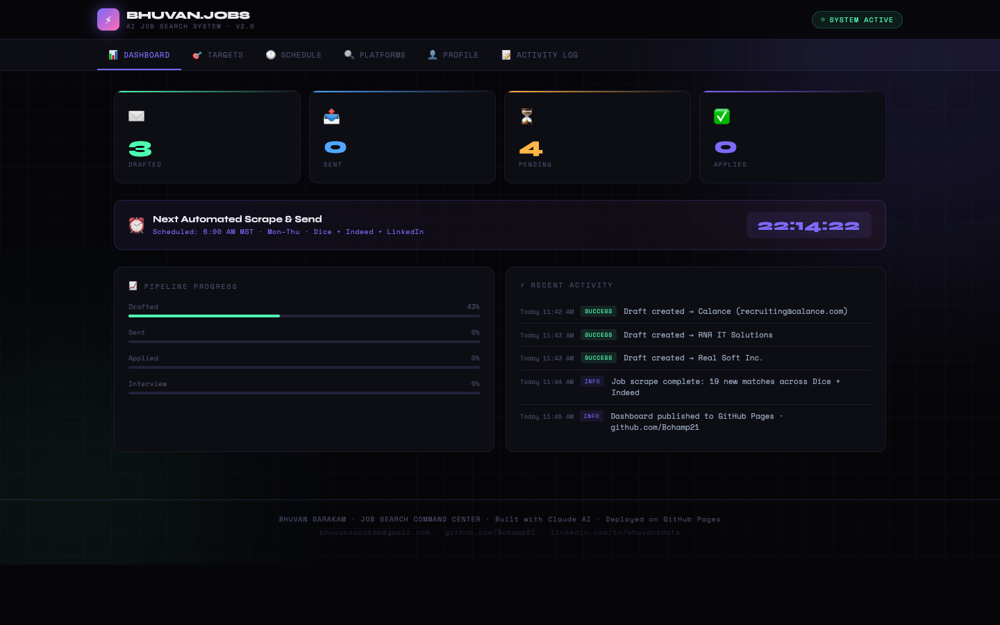

<svg xmlns="http://www.w3.org/2000/svg" viewBox="0 0 800 120" width="800" height="120">
  <rect width="800" height="120" fill="#060609" rx="12"/>
  <g transform="translate(90,60)">
    <animateTransform attributeName="transform" type="rotate" from="0 90 60" to="360 90 60" dur="8s" repeatCount="indefinite"/>
    <circle cx="0" cy="0" r="28" fill="none" stroke="#7c6af7" stroke-width="6"/>
    <circle cx="0" cy="0" r="10" fill="#7c6af7"/>
    <rect x="-5" y="-38" width="10" height="20" rx="3" fill="#7c6af7"/>
    <rect x="-5" y="18" width="10" height="20" rx="3" fill="#7c6af7"/>
    <rect x="-38" y="-5" width="20" height="10" rx="3" fill="#7c6af7"/>
    <rect x="18" y="-5" width="20" height="10" rx="3" fill="#7c6af7"/>
    <rect x="-31" y="-31" width="14" height="10" rx="3" fill="#7c6af7" transform="rotate(45)"/>
    <rect x="-31" y="21" width="14" height="10" rx="3" fill="#7c6af7" transform="rotate(-45)"/>
    <rect x="17" y="-31" width="14" height="10" rx="3" fill="#7c6af7" transform="rotate(-45)"/>
    <rect x="17" y="21" width="14" height="10" rx="3" fill="#7c6af7" transform="rotate(45)"/>
  </g>
  <g transform="translate(178,60)">
    <animateTransform attributeName="transform" type="rotate" from="360 178 60" to="0 178 60" dur="5s" repeatCount="indefinite"/>
    <circle cx="0" cy="0" r="18" fill="none" stroke="#4fffb0" stroke-width="5"/>
    <circle cx="0" cy="0" r="7" fill="#4fffb0"/>
    <rect x="-4" y="-26" width="8" height="14" rx="2" fill="#4fffb0"/>
    <rect x="-4" y="12" width="8" height="14" rx="2" fill="#4fffb0"/>
    <rect x="-26" y="-4" width="14" height="8" rx="2" fill="#4fffb0"/>
    <rect x="12" y="-4" width="14" height="8" rx="2" fill="#4fffb0"/>
    <rect x="-20" y="-20" width="10" height="8" rx="2" fill="#4fffb0" transform="rotate(45)"/>
    <rect x="10" y="-20" width="10" height="8" rx="2" fill="#4fffb0" transform="rotate(-45)"/>
  </g>
  <g transform="translate(248,55)">
    <animateTransform attributeName="transform" type="rotate" from="0 248 55" to="360 248 55" dur="3.5s" repeatCount="indefinite"/>
    <circle cx="0" cy="0" r="13" fill="none" stroke="#ff6ab8" stroke-width="4"/>
    <circle cx="0" cy="0" r="5" fill="#ff6ab8"/>
    <rect x="-3" y="-19" width="6" height="10" rx="2" fill="#ff6ab8"/>
    <rect x="-3" y="9" width="6" height="10" rx="2" fill="#ff6ab8"/>
    <rect x="-19" y="-3" width="10" height="6" rx="2" fill="#ff6ab8"/>
    <rect x="9" y="-3" width="10" height="6" rx="2" fill="#ff6ab8"/>
  </g>
  <text x="310" y="48" font-family="monospace" font-size="26" font-weight="bold" fill="#e8eaf0" letter-spacing="2">BHUVAN.JOBS</text>
  <text x="312" y="72" font-family="monospace" font-size="12" fill="#7c6af7" letter-spacing="3">AI JOB SEARCH SYSTEM · v2.0</text>
  <circle cx="312" cy="95" r="5" fill="#4fffb0">
    <animate attributeName="opacity" values="1;0.2;1" dur="2s" repeatCount="indefinite"/>
  </circle>
  <text x="324" y="99" font-family="monospace" font-size="11" fill="#4fffb0" letter-spacing="2">SYSTEM ACTIVE</text>
</svg>

# Bhuvan Sarakam · Job Search Dashboard

**AI-powered job search command center — built with Claude AI**

## 🖥️ Preview

## 🌐 Live Site

**https://bchamp21.github.io/job-search-dashboard/**

## Features

- 📊 Application pipeline tracker (Drafted → Sent → Applied → Interview)
- 🎯 Target company outreach manager with status tracking
- 🕐 Optimal send-time scheduler with recruiter data insights
- 🔍 Multi-platform job search links (Dice, Indeed, LinkedIn, MigrateMate, BuiltIn, Wellfound)
- 📝 Activity log
- 👤 Profile & skills overview

## Built With

- Vanilla HTML/CSS/JS — zero dependencies, instant load
- Deployed on GitHub Pages
- Built with [Claude AI](https://claude.ai)
